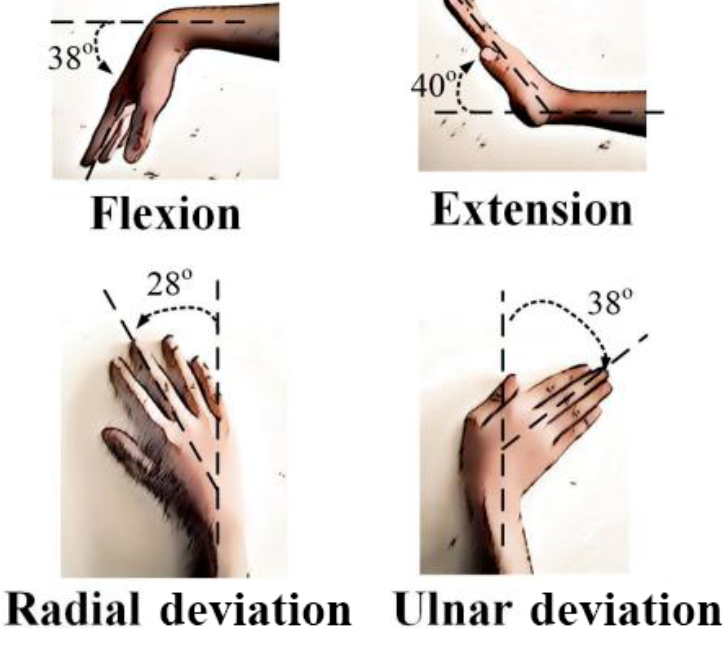

# Touchless: EMG-Driven Hand Gesture Recognition System

## Description
Touchless is a hand gesture recognition project that uses EMG (electromyography) signals from a wearable device (MYO Thalmic bracelet). Instead of cameras or touch input, the system classifies gestures based on muscle activity for touchless control.

## What The System Does
- Reads EMG signals from 8 forearm sensors
- Cleans and processes noisy biosignal data
- Classifies gestures:
  - 0: Unmarked data
  - 1: Hand at rest
  - 2: Hand clenched in a fist
  - 3: Wrist flexion
  - 4: Wrist extension
  - 5: Radial deviation
  - 6: Ulnar deviation
  - 7: Extended palm (not performed by all subjects)

- Maps recognized gestures to real-world actions

## Problem Scenario
In environments where hands are occupied, gloved, or hygiene-sensitive, traditional input methods (keyboard, mouse, touch screen) are inconvenient. Touchless recognizes muscle activity patterns and maps them to gesture classes so devices can be controlled without physical contact.

## Database / Dataset
- Source: UCI Machine Learning Repository
  - https://archive.ics.uci.edu/ml/datasets/EMG+data+for+gestures
- Local file: `EMG-data/EMG-data.csv`
- Size: ~268 MB (4,237,908 rows)
- Columns:
  - Time: Time in milliseconds (ms)
  - Channel 1-8: EMG signal from sensors 1-8
  - Class: Gesture label
  - Label: Subject identifier

## Data Collection Details
- Device: MYO Thalmic bracelet
- Sensors: 8 equally spaced EMG sensors on the forearm
- Subjects: 36
- Gestures: 7 static hand gestures, repeated twice
- Timing: 3 seconds per gesture, followed by 3 seconds rest

## Challenges
- EMG data is noisy and unstructured
- Data contains missing or unmarked segments
- Gesture classes can be hard to separate due to similar muscle activity
